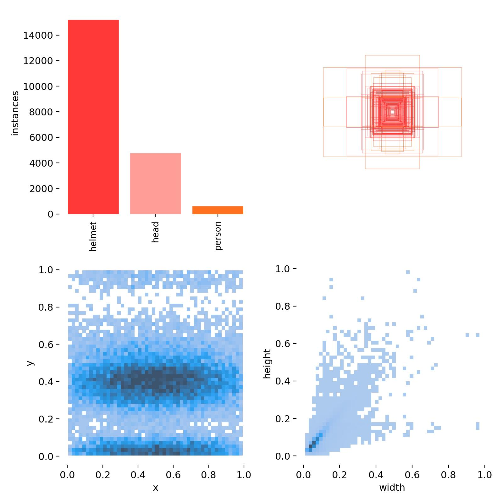

# Object Detection in Computer Vision

Welcome to the *Object Detection* repository, focusing on *Helmet Detection* using Faster R-CNN and YOLOv8 models. This repository contains two project works on object detection.

## Overview

This repository showcases object detection with a special focus on helmet detection using two powerful models: Faster R-CNN and YOLOv8. The projects illustrate the effectiveness of these models in detecting helmets, heads, and persons, with a strong emphasis on helmet detection due to the imbalanced nature of the dataset.

## Dataset

The dataset used in these projects is sourced from Kaggle and contains 5000 images with bounding box annotations in the PASCAL VOC format for three classes: helmet, head, and person. The primary objective is to predict the helmet class, given the data's heavy imbalance.

- *Classes:* Helmet, Head, Person
- *Partition:* 80% Train, 10% Validation, 10% Test




## Project 1: Faster R-CNN

In this project, a pre-trained Faster R-CNN model with a ResNet50 backbone was fine-tuned on the training split of our dataset.

- *Model:* Faster R-CNN with ResNet50 backbone
- *Evaluation Metric:* mAP@0.5
- *Results:* 
  - Green & Yellow Boxes represent the actual & predicted boxes respectively.
  - The model predicted some redundant boxes.
  - mAP@0.5 Value: 


## Project 2: YOLOv8

The second project utilizes the state-of-the-art YOLOv8 model (Medium Version), fine-tuned on the same dataset.

- *Model:* YOLOv8 (Medium Version)
- *Evaluation Metric:* mAP@0.5
- *Results:*
  - The model accurately predicted helmet and head classes with good confidence.
  - Some redundant boxes were predicted.
  - mAP@0.5 Value: 


## Comparison of Models

Comparing the performance of Faster R-CNN and YOLOv8 models:

- *Accuracy:*
  - Faster R-CNN: mAP@0.5 value of 25.34%
  - YOLOv8: mAP@0.5 value of 63.40%
- *Inference Speed:*
  - Faster R-CNN: ~142ms per image
  - YOLOv8: ~10ms per image (83 FPS)

YOLOv8 outperforms Faster R-CNN in both accuracy and speed, making it suitable for real-time detection applications.

## Usage

1. Clone the repository:
   ```bash
   git clone https://github.com/your-username/ObjectDetection.git
   cd ObjectDetection
